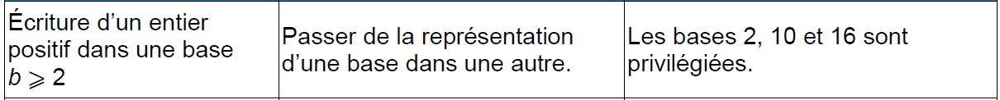
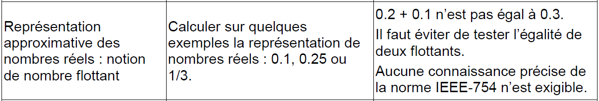
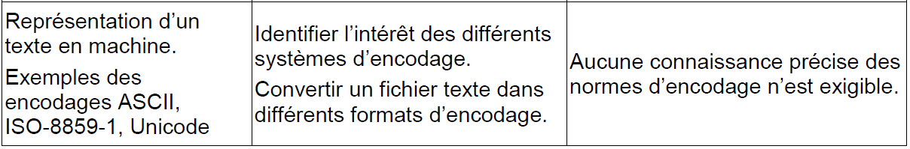

# Représentation des données
??? note "Écriture d’un entier positif dans une base b ⩾ 2"
    {:.center}

    __A VENIR__

??? note "Représentation binaire d’un entier relatif"
    {:.center}

    __A VENIR__

??? note "Représentation approximative des nombres réels : notion de nombre flottant"
    {:.center}
    
    __A VENIR__

??? note "Valeurs booléennes : 0, 1. Opérateurs booléens : and, or, not. Expressions booléennes"
    {:.center}

    __A VENIR__

??? note "Représentation d’un texte en machine. Exemples des encodages ASCII, ISO-8859-1, Unicode"
    {:.center}

    __A VENIR__

