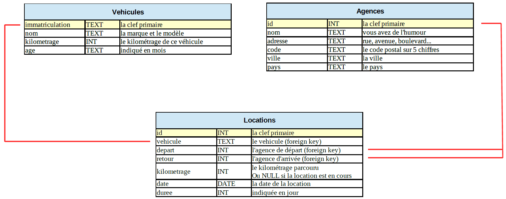

<!--Testez :

{!{ sqlide titre="Tape ta requête SQL ici :" init="BDD/les_Aliens0.sql"}!}
-->

=== "Cours"
    Pour la gestion des accents sur les fichiers SQL clique [ICI](https://www.scriptol.fr/creation-site-web/accents-html.php){target=__blank}
    
    

=== "Exercices"
    ??? note "Exercice 1 : Agences de locations de voitures"
    
        Le schéma relationnel

        
    
        Visualiser toute la relation Agences

        ```sql
        SELECT *
        FROM vehicules
        WHERE kilometrage>10000
        ```

        {!{ sqlide titre="Tape ta requête SQL ici :" init="BDD1/locations.sql"}!}

    ??? note "Exercice 2 : Les communes, départements et régions de France"
        Le schéma relationnel

        !A venir


        __Exécuter__ les 3 requêtes suivantes:
        === "Visualiser toutes les communes"
            ```sql
            SELECT * 
            FROM communes
            ```
        === "Visualiser tous les départements"
            ```sql
            SELECT * 
            FROM departements
            ```
          
        === "Visualiser toutes les régions"
            ```sql
            SELECT * 
            FROM regions
            ```

        {!{ sqlide titre="Tape ta requête SQL ici :" init="BDD1/france.sql"}!}
        
        __Q1. Quelles sont les communes du département 60 ?__

        {!{ sqlide titre="Tape ta requête SQL ici :" init="BDD1/france.sql"}!}
    
        __Q2. Ecrire une requêtes permettant de donner le nombre de communes du département 60 ?__
        
        {!{ sqlide titre="Tape ta requête SQL ici :" init="BDD1/france.sql"}!}
    

[📄 Accueil](../../../){ .md-button }

