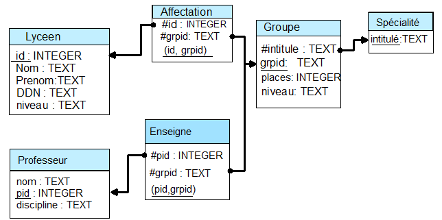

<!--Testez :

{!{ sqlide titre="Tape ta requête SQL ici :" init="BDD/les_Aliens0.sql"}!}
-->

=== "Cours"
    Pour la gestion des accents sur les fichiers SQL clique [ICI](https://www.scriptol.fr/creation-site-web/accents-html.php){target=__blank}
    
    

=== "Exercices"
    __`Méthode générale`__

    Questions à se poser pour écrire la requête :

    - que voudra-t-on faire des informations obtenues ?
        - les afficher : SELECT
        - les modifier : UPDATE
        - les supprimer DELETE
    - quelles sont les informations nécessaires pour cela ? => noms des attributs correspondants
    - dans quelle(s) table(s) ces informations se trouvent-elles ?
        - => FROM
        - Si les informatons sont dans des tables différentes, il faudra réaliser une jointure.
            - Dans ce cas, quelle(s) sont les attributs (colonnes) permettant de relier les informations contenues dans les tables ?
    - faut-il appliquer au résultat des filtres, des agrégateurs, un tri ... pour obtenir les information souhaitées?

    ??? note "Exercice 1 : Agences de locations de voitures"
    
        Le schéma relationnel

        
    
        Visualiser toute la relation Agences

        ```sql
        SELECT *
        FROM vehicules
        WHERE kilometrage>10000
        ```

        {!{ sqlide titre="Tape ta requête SQL ici :" init="BDD1/locations.sql"}!}

    ??? note "Exercice 2 : Les communes, départements et régions de France"
        Le schéma relationnel

        !A venir


        __Exécuter__ les 3 requêtes suivantes:
        === "Visualiser toutes les communes"
            ```sql
            SELECT * 
            FROM communes
            ```
        === "Visualiser tous les départements"
            ```sql
            SELECT * 
            FROM departements
            ```
          
        === "Visualiser toutes les régions"
            ```sql
            SELECT * 
            FROM regions
            ```

        {!{ sqlide titre="Tape ta requête SQL ici :" init="BDD1/france.sql"}!}
        
        __Q1. Quelles sont les communes du département 60 ?__

        {!{ sqlide titre="Tape ta requête SQL ici :" init="BDD1/france.sql"}!}
    
        __Q2. Ecrire une requêtes permettant de donner le nombre de communes du département 60 ?__
        
        {!{ sqlide titre="Tape ta requête SQL ici :" init="BDD1/france.sql"}!}
    
    ??? note "Exercice 3 : Gestion simplifier d'un lycée"
        On travaille avec la base de données dont le schéma est donné ci-dessous:

        {: .center}


        __Exécuter__ les 2 requêtes exemples suivantes:
        === "Exemple 1"
            On veut afficher le nom du ou des professeurs enseignant la spécialité pour le groupe dont l'identifiant `grpid` est `1SVTG1`.

            Il s'agit d'un affichage, la requête commence par __SELECT__.

            Les noms des professeurs sont contenus dans la colonne `nom` de la table ^^Professeur^^.

            L'information sur qui enseigne quoi est dans la table ^^Enseigne^^. Cette table contient les `grpid`.

            On va donc devoir effectuer une __jointure__ entre les deux tables.
            
            Pour que le résultat associe un professeur aux groupes où il enseigne, on va utiliser comme critère de jointure l'égalité entre les `pid`, en écrivant soit `ON professeur.pid=Enseigne.pid`.

            De plus on ne veut que les noms du ou des professeurs enseignant du groupe `1SVTG1` : on va donc appliquer un filtre avec WHERE : `WHERE grpid="1SVTG1"`

            La requête complète s'écrira :
                ```sql
                SELECT nom FROM Professeur 
                JOIN Enseigne ON Professeur.pid=Enseigne.PID 
                WHERE grpid='1SVTG1'
                ```
               
        === "Exemple 2"
            On veut les noms des élèves suivant la spécialité d'intitulé "Physique-Chimie".
            Il s'agit d'un affichage, la requête commence par SELECT.

            Les noms des élèves sont dans la colonne nom de la table Lyceen.
            Les intitulés des spécialités sont dans la table Groupe.    
            L'information sur les inscriptions en spécialité est dans la table Affectation.

            On va donc devoir faire une jointure entre ces trois tables. La jointure entre Lyceen et Affectation va être faite en utilisant id, celle entre Affectation et Groupe en utilisant grpid.

            On veut seulement les noms des élèves inscrits en Physique-Chimie : on ajoute donc un filtre "WHERE".

            La requête peut s'écrire :
                ```sql
                SELECT nom FROM Lyceen
                JOIN Affectation ON Affectation.id = Lyceen.id
                JOIN Groupe ON Groupe.grpid=Affectation.grpid
                WHERE Intitule="Physique-Chimie"
                ```
        {!{ sqlide titre="Tape ta requête SQL ici :" init="BDD1/eleve.sql"}!}
    
        Exercice 1 : Jointures impliquant deux tables

        a. __Utiliser__ une jointure entre les tables ^^Lyceen^^ et ^^Affectation^^ pour associer chaque lycéen inscrit dans un groupe de spécialité avec chacun des identitfiants `grpid` des groupes où il est inscrit, en affichant le résultat sous la forme

        {: .center}

        | **nom** | **prenom** | **grpid** |
        |---|---|---|
        | Tilliou |	Sébastien |	TMathG2 |
        | Hébert |	Juliette |	TMathG2 |
        | Ouaderni | Lina |	TSVTG1 |
        | etc | ... |...  |

        {!{ sqlide titre="Tape ta requête SQL ici :" init="BDD1/eleve.sql"}!}

        b. __Utiliser__ une jointure entre les tables ^^Professeur^^ et ^^Enseigne^^ pour associer chaque nom de professeur avec chacun des identitfiants `grpid` des groupes de spécialité dans lesquels il enseigne. On doit obtenir une table de la forme

        {: .center}

        | **nom** | **grpid**  | 
        |---|---|
        | Mr Bernal |	1NSIG1 |
        | Mme Lieville | TMathG2 |
        | Mr El Khatib | 1MathG2 |
        | Mr Scalaire |	1MathG3 |  

        comptant 27 lignes

        {!{ sqlide titre="Tape ta requête SQL ici :" init="BDD1/eleve.sql"}!}
        
        
        
[📄 Accueil](../../../){ .md-button }

