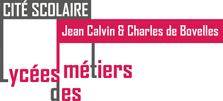

# Bienvenue sur le site des NSI du lycée Jean CALVIN

 <!-- Site calvin :-->
 <!-- <figure>
 <!-- -->
 <!-- <figcaption> Le lycée</figcaption>-->
 <!-- </figure>-->

<!-- # Image flottantes-->
{width=30% align=left}
Bienvenue sur le site des sciences de l'Informatique et du Numérique

# Sommaire

=== "Programme de Première"
    !!! note "Les chapitres"
        1. [Les Bases de Python](../essai/EssaiCode/Essai_code) 
        2. 
        3. 

=== "Programme de Terminale"
    !!! note "Les chapitres"
        1. [Bases de données - Langage SQL](../essai/TNSI/Bases_De_Donnees/Bases_De_Donnees)
        2. Récursivité
        3. La programmation orientée objet
        4. Les arbres
        5. Les piles
        6. Les files
        7. Les graphes
        8. Les processus
        9. Le routage : RIP et OSFP
        10. Diviser pour régner

